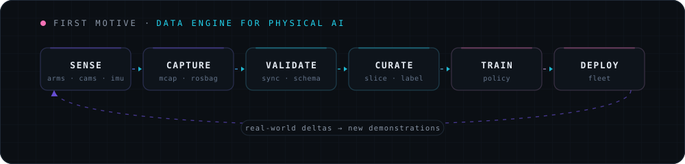

<div align="center">




<br />

<a href="https://ubundi.com/"></a>
<!-- TODO Wynand: swap in your real LinkedIn URL below -->
<a href="https://www.linkedin.com/in/wynand-neethling/"></a>
<a href="mailto:wynand@ubundi.co.za"></a>


</div>

<br />

## Hi, I'm Wynand

I build AI systems that know things. Not systems that guess well — systems that carry real context about a business and can be asked hard questions about it.

The route here was sideways. I started in data engineering, spent time as a data consultant in Amsterdam, and now work as founding AI engineer at [Ubundi](https://ubundi.com/), where I build enterprise AI solutions.

The through-line is the same in every role: **the model is rarely the hard part. The data around it is.**

<br />

## The Thread

<div align="center">
  
</div>

Every job I have had is some version of the same question: *how do you get the right information to the thing that has to make the decision?* Warehouses answered it for dashboards. Knowledge graphs answer it for agents. Trajectory data answers it for robots.

<br />

## Right Now

```text
role            Founding AI Engineer · Ubundi
based           Stellenbosch, South Africa · UTC+2
before          Data consultant, Amsterdam · data engineer
core            Knowledge graphs · GraphRAG · RAG · context engineering
shipping        Enterprise AI systems that hold real organisational context
project         First Motive — the data engine for physical AI
learning        ROS 2 Humble · teleoperation · trajectory quality · MCAP
open question   Can a graph know a company well enough to be useful to everyone in it?
```

<br />

## The Curiosity

<div align="center">
  
</div>

Most enterprise AI reads documents. That is a thin slice of what a company actually knows.

The thing I keep circling is richer: a graph where people, teams, projects, decisions, customers, meetings and code are all nodes, and the edges carry *why* and *when*. Ask it who owns the churn model and you should get the person, the decision that put them there, the doc explaining the trade-off, and the customer that triggered it — in one traversal, not five searches.

| Open question | Why it is hard |
|---|---|
| What is the right ontology for a company? | Too rigid and nobody maintains it. Too loose and nothing resolves. |
| How do you keep the graph fresh? | Companies change faster than anyone updates a schema. |
| When does a graph beat plain retrieval? | Multi-hop, temporal, and "why" questions — vectors flatten all three. |
| How do you keep it trustworthy? | An answer needs provenance, or it is just a confident guess. |

<br />

## First Motive — A Data Engine For Physical AI

<div align="center">
  
</div>

Physical AI has the same bottleneck as enterprise AI, wearing different clothes. Nobody is short of models. Everyone is short of clean, trustworthy, well-described demonstration data.

At Ubundi I work on **First Motive**: the pipeline that turns real robot motion into training data worth using — capture, validation, curation, and the feedback loop back to the fleet. Which is how I ended up learning robotics on the side: you cannot fix trajectory data you do not understand.

The public ROS 2 stack lives here on my profile — teleop, robot description, bringup, and the workspace that assembles them.

<br />

## Featured Work

| Repo | What it is |
|---|---|
| [**fm-ros2**](https://github.com/WynandNeethling/fm-ros2) | Orchestrator for First Motive's ROS 2 (Humble) stack — assembles the per-package repos into one colcon workspace via `vcs`, plus Docker, dev container, CI and full-system docs. |
| [**fm-teleop**](https://github.com/WynandNeethling/fm-teleop) | Teleop layer. Every input — gamepad, keyboard, vision hand-tracking — behind one command contract. |
| [**fm-robot**](https://github.com/WynandNeethling/fm-robot) | Robot layer: URDF description, controllers, sensor drivers. |
| [**fm-app**](https://github.com/WynandNeethling/fm-app) | Application layer: bringup launch orchestration and the operator TUI. |
| [**recommender-system**](https://github.com/WynandNeethling/recommender-system) | Recommender built from the ground up rather than imported. |
| [**nlp-eng-afr-translation**](https://github.com/WynandNeethling/nlp-eng-afr-translation) | English→Afrikaans translation with RNNs and attention. Low-resource language, honest evaluation. |
| [**nlp-skipgram-embeddings**](https://github.com/WynandNeethling/nlp-skipgram-embeddings) · [**nlp-trigram-models**](https://github.com/WynandNeethling/nlp-trigram-models) | Embeddings and character-level language ID, written without the framework doing the thinking. |
| [**cv-object-detection**](https://github.com/WynandNeethling/cv-object-detection) · [**rl-dqn-agent**](https://github.com/WynandNeethling/rl-dqn-agent) | Vision and deep RL foundations — the groundwork the robotics work now leans on. |

<details>
  <summary><b>What is not public</b></summary>

<br />

Most of the enterprise AI work — client knowledge graphs, retrieval systems, evaluation harnesses, internal agent tooling — is private by necessity. The pattern generalises even when the code cannot: build the context layer first, make retrieval explainable, and treat evaluation as part of the system rather than a report you write afterwards.

</details>

<br />

## Toolbelt

<div align="center">


<br /><br />


</div>

<br />

## Signal

<div align="center">

<!-- Rendered daily by .github/workflows/signal.yml straight from the GitHub API. -->


<br /><br />

<picture>
  <source media="(prefers-color-scheme: dark)" srcset="https://raw.githubusercontent.com/WynandNeethling/WynandNeethling/output/github-snake-dark.svg" />
  <source media="(prefers-color-scheme: light)" srcset="https://raw.githubusercontent.com/WynandNeethling/WynandNeethling/output/github-snake.svg" />
  
</picture>

</div>

<br />

## Notes To Self

<details>
  <summary><b>Why knowledge graphs, and not just better retrieval</b></summary>

<br />

Vector search is excellent at "find me something similar" and quietly bad at "how are these two things related". Companies mostly ask the second kind of question. A graph makes the relationship a first-class object, so a system can walk from a person to a decision to the document that justified it — and show its working. Retrieval gets you a passage. A graph gets you an explanation.

</details>

<details>
  <summary><b>What data consulting taught me that engineering did not</b></summary>

<br />

That the correct pipeline and the useful pipeline are often different pipelines. Consulting forces you to sit with the person who has to act on the output. You learn quickly which technical decisions people actually feel, and which ones only matter to you.

</details>

<details>
  <summary><b>Why an AI engineer is learning robotics</b></summary>

<br />

Physical AI is a data problem wearing a hardware costume. To judge whether a demonstration is good training data, you need to understand what the robot was doing, what the controller was fighting, and where the sensor timestamps lie to you. So: ROS 2, teleoperation, kinematics, MCAP. Not to become a roboticist — to build the data engine properly.

</details>

<details>
  <summary><b>How I work</b></summary>

<br />

Context first, then the model. Small systems that are easy to inspect beat clever systems nobody can debug. Write the evaluation before the demo. And keep a human accountable for anything the system claims to be true.

</details>

<br />

## Find Me

<div align="center">

<a href="https://ubundi.com/"></a>
<a href="https://www.linkedin.com/in/wynand-neethling/"></a>
<a href="mailto:wynand@ubundi.co.za"></a>

<br /><br />

<i>Open to talking about knowledge graphs, GraphRAG, context-aware systems, and robot data.</i>

<br /><br />


</div>
